# 02. 用户流程与状态设计

## 1. 设计原则

- 首次使用有明确步骤引导，完成核心闭环后允许自由进入模块。
- 所有消耗额度的操作必须在提交前明确展示预计消耗并由用户确认。
- 所有长任务必须异步执行，用户可关闭页面后继续。
- 所有历史检测报告不可覆盖。
- 文章优化只保留用户最终选择的当前稿，不做复杂版本系统。

## 2. 注册验证与套餐流程

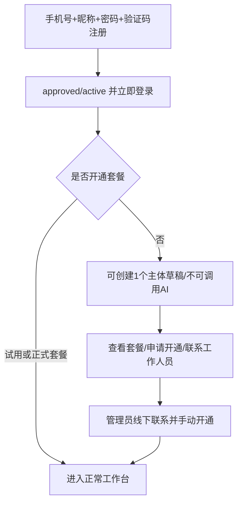

历史 pending/rejected 账号及人工审核记录继续兼容，但普通新注册不再进入管理员首登审批队列。

### 2.1 注册异常

- 手机号已存在：提示登录或找回密码。
- 验证码错误或过期：不创建账号。
- 密码不符合要求：前端和后端同时校验。
- 注册成功但短信通知失败：账号仍创建，记录通知失败。

### 2.2 账号正常但无套餐

可执行：

- 创建并编辑一个主体草稿
- 查看套餐
- 提交套餐开通申请
- 查看公告和设置

不可执行：

- AI 补充主体资料
- 关键词、蒸馏、问题库
- GEO 检测
- 改善策略
- 文章、图片、AI 助手

## 3. 首次 GEO 引导流程

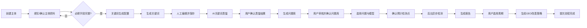

完成条件：首次正式 GEO 检测报告产生，并成功生成一份改善策略。文章和发布不作为必选步骤。

## 4. 主体创建流程

### 4.1 基本步骤

1. 用户点击“新建主体”。
2. 选择主体类型。
3. 系统加载公共字段和该类型动态字段。
4. 用户填写主体名称、官方链接等信息。
5. 用户可选择 AI 辅助补充资料。
6. 系统读取来源并生成待确认字段。
7. 用户逐项或批量确认。
8. 系统检查必填项和风险规则。
9. 正常主体直接可用；高风险或疑似冒用进入人工审核。

### 4.2 主体资料修改

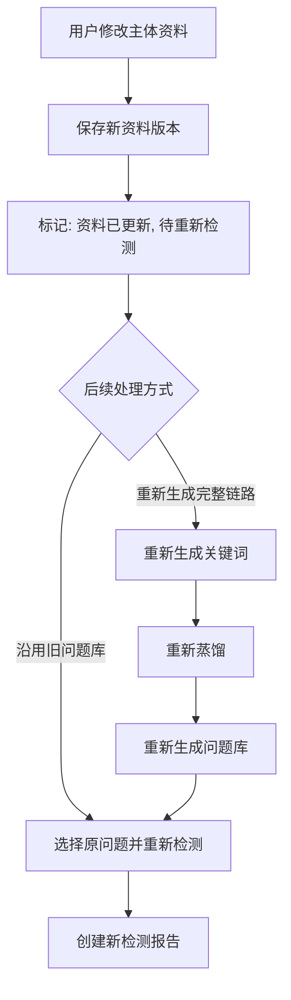

旧报告、原始回答、评分和策略保持不变。

## 5. 关键词生成流程

### 5.1 配置

用户选择：

- 目标生成数量（不超过套餐上限）
- 短关键词（可选）
- 长尾关键词（可选）
- 地区关键词（可选）
- 地区范围（仅选择地区关键词时显示）

三种类型都不选时，系统生成通用关键词。

### 5.2 生成结果处理

- AI 返回的数量可少于目标数量。
- 用户可新增、编辑、删除。
- 用户点击“保存并生成新版本”后创建正式关键词版本。
- 首次生成不占重新生成次数。
- 重新调用 AI 成功后消耗该主体当月关键词重新生成次数。

## 6. 关键词蒸馏流程

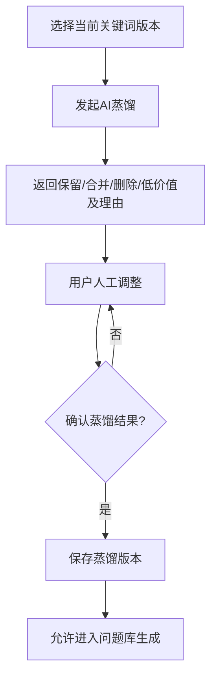

地区不同但意图独立的词不得自动合并。

## 7. 问题库流程

### 7.1 生成

系统根据蒸馏关键词、主体资料和问题分类生成问题。实际数量不超过套餐上限，且不要求填满上限。

### 7.2 审核

用户可修改：

- 问题文本
- 主分类
- 辅助标签
- 高／中／低优先级
- 自然探索型／品牌指向型
- 是否参与本次检测

确认后保存正式问题库版本。

### 7.3 手动修改

- 当前版本可连续修改为草稿。
- 点击“保存并生成新版本”后创建正式版本。
- 手动修改不消耗 AI 重新生成次数。
- 历史报告继续绑定原问题库快照。

## 8. GEO 检测提交流程

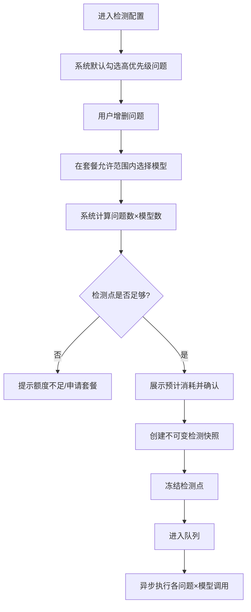

检测快照包含：主体资料版本、关键词版本、蒸馏版本、问题库版本、实际问题、模型组合、评分规则版本、提示词版本和开始时间。

## 9. 检测执行与进度

### 9.1 用户视图

显示：

- 总体百分比
- 8 个模型状态
- 已完成模型数
- 成功／失败数量
- 已扣除／已返还检测点
- 排队位置（排队时）

### 9.2 用户离开页面

刷新、退出或关闭浏览器不影响任务。重新登录后从检测记录恢复进度。

### 9.3 取消

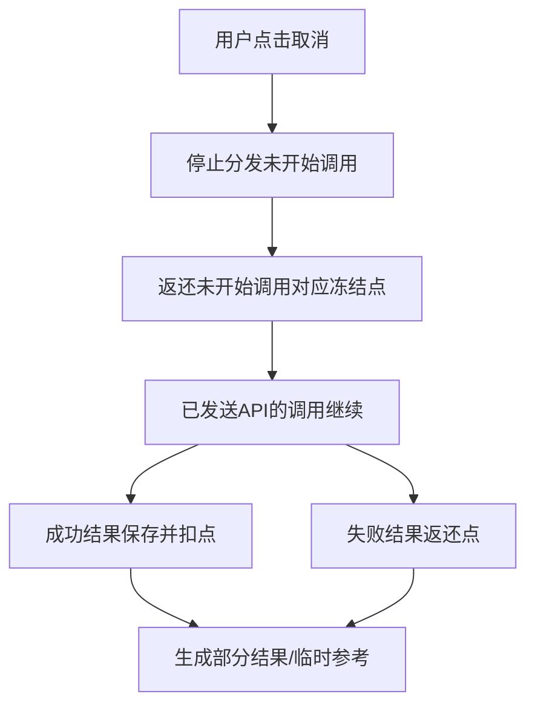

## 10. 报告浏览流程

### 10.1 首页

- GEO 综合得分
- 品牌认知与口碑得分
- 曝光潜力指数
- 8 模型得分
- 六维评分
- 竞品曝光参考
- 历史趋势

### 10.2 明细

按问题分组。每个问题下展示各模型：

- 是否提及
- 推荐等级
- 排名
- 单题分数
- 关键片段
- 引用来源
- 展开完整原始回答

不生成证据图片。

## 11. 复测流程

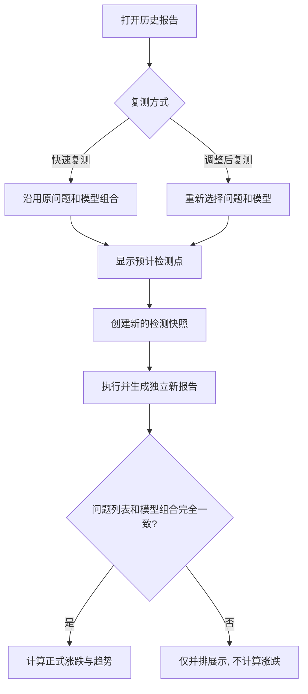

主体资料版本允许变化；如变化，趋势中必须标注。

## 12. 改善策略流程

1. 用户在报告页点击“生成改善策略”。
2. 选择 7 天、30 天、90 天或自定义周期。
3. 系统首次免费调用 DeepSeek。
4. 展示：主要问题、优先方向、模型薄弱项、建议内容主题、建议渠道和复测建议。
5. AI 原文不可编辑；用户可添加个人备注。
6. 推荐文章主题可跳转文章生成页并预填信息。
7. 同一报告重新生成策略时，检查套餐次数并扣减重生成次数。

## 13. 文章生成流程

### 13.1 入口

- 改善策略推荐主题
- 文章中心自由创建

所有文章必须选择主体。

### 13.2 配置

- 文章类型或自定义类型
- AI 推荐内容深度，用户可调整
- 直接生成／先确认大纲
- 是否联网（受文章类型规则约束）
- 资料来源范围
- 用户文件／网页链接
- 是否需要引用

### 13.3 大纲模式

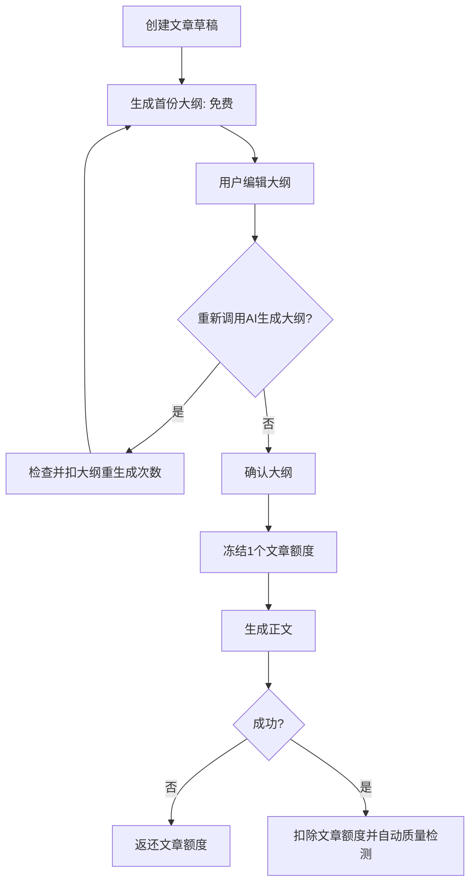

### 13.4 直接生成模式

提交前冻结 1 个文章额度；成功后扣除，失败返还。

### 13.5 资料包

- 系统检索和解析资料。
- 展示来源、正文和冲突。
- 用户确认上传资料的解析结果。
- 关键事实冲突时暂停并让用户选择。
- DeepSeek 只基于确认主体资料和资料包写作。

## 14. 文章审核与质量流程

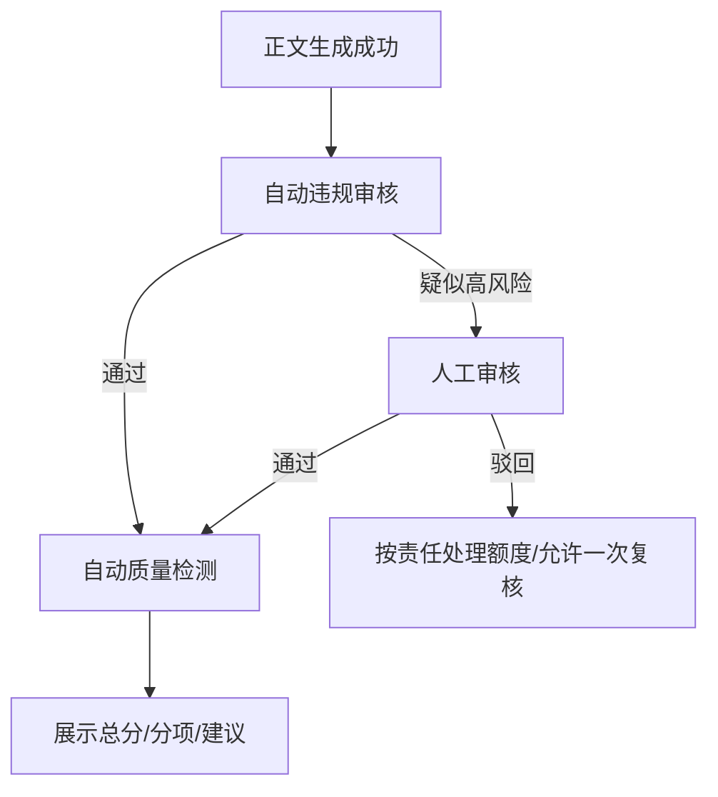

质量分不限制导出或发布；违规审核可拦截。

## 15. 文章优化流程

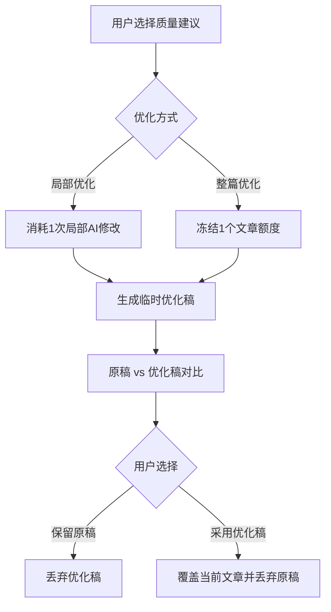

系统始终只保留当前文章稿，不保留版本历史。

## 16. 渠道适配流程

1. 用户打开当前文章。
2. 选择一个或多个渠道。
3. 系统显示预计文章额度：渠道数量。
4. 冻结对应文章额度。
5. 为每个渠道独立异步生成适配稿。
6. 每个成功稿扣 1 个文章额度；失败返还。
7. 每个稿自动执行一次质量检测。
8. 渠道稿可编辑、导出和用于发布。

渠道稿是原文章的关联发布稿，不属于文章版本历史。

## 17. 图片生成流程

### 17.1 AI 推荐配图

1. 分析文章结构。
2. 推荐封面和正文插图位置、用途、尺寸、风格和提示词。
3. 用户修改并选择要生成的图片。
4. 提交前显示预计图片额度。
5. 逐张或批量调用豆包。

### 17.2 手动生图

用户选择：主体、文章（可选）、图片用途、尺寸、风格、提示词和参考图。

### 17.3 审核与额度

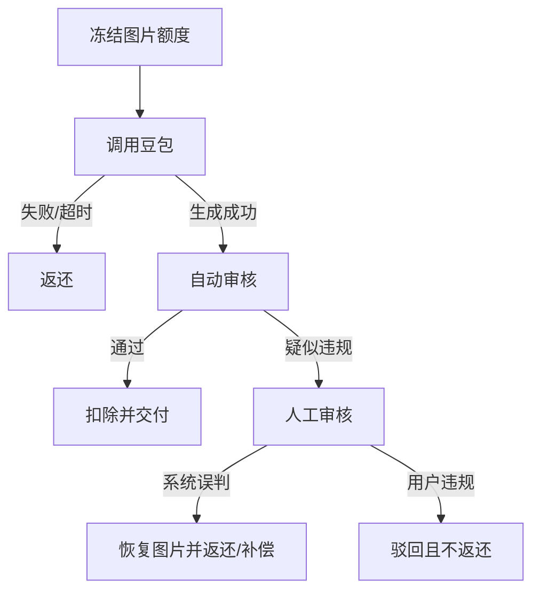

### 17.4 保存

用户选择：仅当前文章使用／保存到主体图片库。

## 18. 发布检测流程

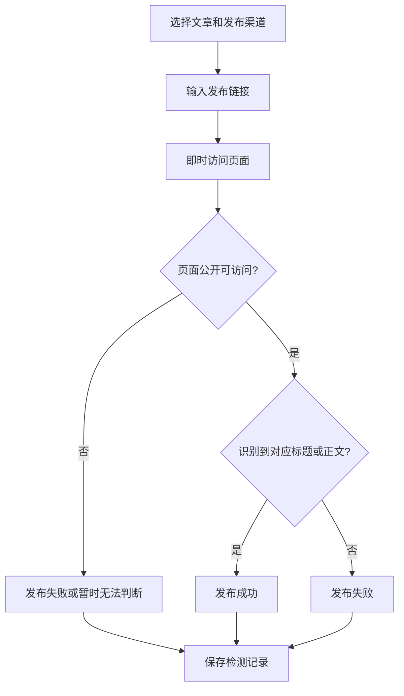

不做后续自动复查。

## 19. 报告导出与分享流程

### 19.1 导出

- PDF
- Word
- Excel 明细

白标权限由套餐控制。默认显问品牌。

### 19.2 分享

1. 用户生成完整报告分享链接。
2. 可设置密码和有效期。
3. 分享页展示完整报告。
4. 访问者可下载 PDF。
5. 用户可随时关闭。

## 20. 显问 AI 助手流程

1. 用户打开助手。
2. 系统注入当前主体的已确认业务上下文。
3. 用户提问。
4. 检查套餐对话次数。
5. DeepSeek 返回成功后扣 1 次。
6. 助手只回答和提供页面入口，不执行任务。
7. 刷新或关闭窗口后清空，不保存聊天。

## 21. 用户反馈流程

1. 选择关联主体或模块。
2. 填写描述并上传截图。
3. 提交后状态为“待处理”。
4. 管理员回复后为“已回复”。
5. 用户在站内消息和反馈详情查看。
6. 管理员或用户确认后关闭。

## 22. 账号注销流程

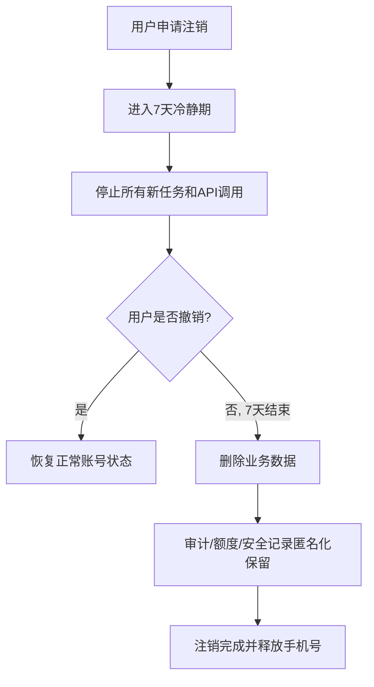

重新注册生成新用户 ID，必须重新审核，不恢复旧权益。

## 23. 关键页面状态规范

所有异步功能统一使用：

- 草稿
- 等待中
- 执行中
- 审核中（适用时）
- 成功
- 部分成功
- 失败
- 已取消
- 已过期

所有错误页面必须提供：用户可理解的原因、是否返还额度、下一步操作。不得向普通用户展示完整错误堆栈和供应商敏感信息。
