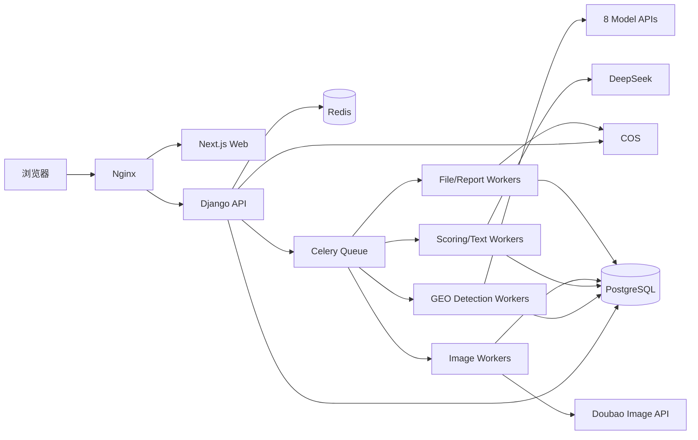

# 10. 技术架构、部署与运维要求

## 1. 架构原则

- V1 使用模块化单体，不拆微服务。
- Web 请求与 AI 长任务分离。
- PostgreSQL 保存永久业务数据。
- Redis 用于 Celery 消息代理、短期状态、限流、验证码和分布式锁。
- COS 保存文件、图片、报告和导出物。
- 所有外部模型调用通过统一适配器。
- 第一版任务进度使用轮询，不使用复杂 WebSocket。

## 2. 当前基础设施

| 组件 | 当前状态 |
|---|---|
| 应用服务器 | 腾讯云，4 vCPU、8 GiB 内存、5 Mbps 公网带宽，Linux |
| PostgreSQL | 16.14，高可用，2 vCPU、4 GiB、100 GB |
| Redis | 7.0，1 GB，1 主 1 副，内网访问 |
| COS | 未开通 |
| 短信 | 未开通 |
| 8 模型检测 API | 已有凭证，待逐一接口验收 |
| DeepSeek 内容能力 | 待开通／验收 |
| 豆包图片能力 | 待开通／验收 |

应用服务器、数据库和 Redis 应保持同地域、同 VPC，并使用内网连接。

## 3. 技术栈

### 3.1 前端

- Next.js
- TypeScript
- Ant Design
- React Query 或等价服务端状态库
- 表单：React Hook Form 或等价方案
- 图表：ECharts 或等价方案

### 3.2 后端

- Python 3.12
- Django 5.2 LTS
- Django REST Framework
- Celery
- PostgreSQL 驱动
- Redis 客户端

### 3.3 运行与代理

- Docker Compose
- Nginx
- Gunicorn
- Celery Worker／Beat

### 3.4 文件与外部服务

- 腾讯云 COS 私有桶
- 腾讯云短信或已批准短信服务
- 8 模型 API
- DeepSeek 内容／评分
- 豆包图片

开发启动时必须锁定精确依赖版本；不得使用浮动 `latest` 镜像进入生产。

## 4. 逻辑架构



## 5. 推荐代码仓库结构

```text
repo/
├── frontend/
│   ├── app/
│   ├── components/
│   ├── features/
│   ├── lib/
│   └── tests/
├── backend/
│   ├── config/
│   ├── apps/
│   │   ├── accounts/
│   │   ├── admins/
│   │   ├── plans/
│   │   ├── quotas/
│   │   ├── subjects/
│   │   ├── documents/
│   │   ├── keywords/
│   │   ├── questions/
│   │   ├── ai/
│   │   ├── geo/
│   │   ├── articles/
│   │   ├── images/
│   │   ├── publishing/
│   │   ├── notifications/
│   │   ├── crm/
│   │   └── audit/
│   ├── tests/
│   └── manage.py
├── infra/
│   ├── nginx/
│   ├── docker/
│   ├── scripts/
│   └── monitoring/
├── docs/
└── docker-compose.yml
```

## 6. Docker Compose 服务

建议生产至少包含：

- `nginx`
- `frontend`
- `api`
- `celery_geo`
- `celery_text`
- `celery_image`
- `celery_files`
- `celery_beat`

PostgreSQL 和 Redis 使用云托管实例，不在生产 Compose 内自建。

## 7. Celery 队列

```text
geo_detection    8模型调用
geo_scoring      DeepSeek评分和报告聚合
text_generation  主体补充、关键词、蒸馏、问题库、策略、文章、助手
image_generation 豆包生图和AI图片处理
file_processing  文件解析、网页抓取、导出、ZIP
system_tasks     通知、重置、保留期、清理、健康检查
```

### 7.1 初期 Worker 建议

当前 4 vCPU / 8 GiB 服务器上，外部 API 任务以 I/O 为主，但仍需控制内存：

- API Gunicorn：2–3 workers，按压测调整
- `celery_geo`：4–8 并发，受全站和每模型信号量二次限制
- `celery_text`：2–4 并发
- `celery_image`：1–2 并发
- `celery_files`：1–2 并发

不要一次启动过高并发。正式值以压力测试和内存监控为准。

### 7.2 任务路由

业务任务必须显式指定队列。禁止所有任务进入默认队列。

### 7.3 任务幂等

- 业务数据库记录是任务事实来源。
- Celery Task ID 不是业务主键。
- Worker 开始、成功、失败和重试均使用事务更新业务状态。
- 重复投递不重复生成业务对象或扣额度。

## 8. Redis 使用边界

Redis 用于：

- Celery Broker
- 短期任务状态缓存
- 短信验证码辅助状态
- 用户／IP 限流
- 分布式锁和模型并发信号量
- 页面进度缓存

不得把以下只存 Redis：

- 额度余额和流水
- 检测报告
- 文章
- 模型原始回答
- 用户账号

永久事实必须落 PostgreSQL。

## 9. PostgreSQL 连接

- 使用内网地址。
- 启用 SSL（云数据库支持时）。
- 使用独立应用账号，非超级用户。
- 连接池上限与数据库规格匹配。
- Web 和 Celery 可共享连接池配置，但须限制每进程连接数。
- 迁移使用独立部署步骤，不由所有容器启动时并发执行。

## 10. COS 设计

### 10.1 桶

建议至少：

- 私有生产桶
- 可选独立备份桶

### 10.2 对象路径

```text
users/{user_uuid}/subjects/{subject_uuid}/documents/{document_uuid}/...
users/{user_uuid}/subjects/{subject_uuid}/images/{image_uuid}/...
users/{user_uuid}/subjects/{subject_uuid}/reports/{report_uuid}/...
exports/{user_uuid}/{export_uuid}/...
temp/{job_uuid}/...
```

对象键不包含手机号、真实姓名或敏感主体明文。

### 10.3 访问

- 私有读写。
- 上传使用预签名或后端受控签名。
- 下载使用短期签名。
- 临时文件设置生命周期自动清理。
- 生成图片从供应商 URL 获取后立即转存。

## 11. 短信

用途仅限：

- 验证码
- 注册审核结果
- 账号安全
- 套餐到期提醒
- 严重系统告警（超级管理员）

开发环境使用 Mock，不向真实手机号发送。生产需配置签名、模板 ID、频率和失败告警。

## 12. 环境划分

至少：

- `local`
- `test`
- `staging`
- `production`

不同环境使用独立数据库、Redis 命名空间／实例、COS 路径和 API 凭证。禁止测试环境访问生产数据或生产密钥。

## 13. 配置和环境变量

参见 `config/env.example`。原则：

- 非敏感运行配置可通过环境变量或数据库系统配置。
- 敏感值通过云密钥管理或加密变量注入。
- 不在镜像中写入生产 `.env`。
- 应用启动时验证必需配置并失败退出，不带缺省危险值启动。

## 14. Nginx

职责：

- HTTPS 终止
- 反向代理 Next.js 和 Django
- 静态资源缓存
- 请求大小限制
- 基础限流
- 安全响应头
- 隐藏内部端口

生产只开放 80／443，80 跳转 HTTPS。

## 15. 前端部署

两种可选：

1. Next.js Node Server 容器
2. 可静态化页面使用静态资源，但含认证和动态页面仍由 Node 服务

用户端和后台共享代码仓库，但使用独立路由组和权限边界。

## 16. 数据库迁移

- 通过 Django Migration。
- 每次部署先备份，再运行迁移。
- 大表变更使用分阶段兼容迁移。
- 生产禁止手工改表。
- 回滚计划必须在发布前写明。

## 17. CI/CD

### 17.1 CI

- Python 格式、Lint、类型检查
- Node 格式、Lint、TypeScript 检查
- 单元测试
- API 集成测试
- 数据库迁移检查
- OpenAPI 校验
- 依赖漏洞扫描
- Secret 扫描
- Docker 构建

### 17.2 CD

- 构建不可变镜像
- 部署到 Staging
- 自动冒烟测试
- 人工批准生产发布
- 数据库备份
- 迁移
- 滚动或短暂停机部署
- 发布后健康检查

## 18. 监控

### 18.1 应用

- API 请求量、P50/P95/P99、错误率
- 用户登录和短信失败
- 任务创建和完成率
- 额度异常

### 18.2 Celery

- 每队列长度
- 排队时间
- 运行时间
- 成功／失败／重试
- Worker 心跳

### 18.3 模型

- 每模型调用量
- 成功率
- 429、超时和认证错误
- P95 延迟
- Token 和成本
- 联网降级率

### 18.4 基础设施

- CPU、内存、磁盘、网络
- PostgreSQL 连接、锁、慢查询、存储
- Redis 内存、连接、命中和延迟
- COS 错误

## 19. 日志

- 结构化 JSON 日志。
- 全链路 `request_id`、`task_id`、`model_call_id`。
- 不记录密钥、密码、验证码和完整敏感文件内容。
- 用户可见错误与内部错误分离。
- 日志保留按类型配置，普通应用日志不永久保存。

## 20. 告警

按等级：

- 普通：后台
- 重要：后台＋站内
- 严重：后台＋站内＋短信

告警应聚合，避免同一故障短信风暴。

## 21. 备份

默认：每日增量、每周完整；超级管理员可配置。

保存：

- 应用服务器本地近期备份
- 同云独立对象存储
- 跨云／异地关键完整备份

数据库和 COS 分别备份，备份加密且账号隔离。

## 22. RPO／RTO

按数据类型配置。建议初始目标：

| 数据 | 建议 RPO | 建议 RTO |
|---|---:|---:|
| 用户、套餐、额度 | 15 分钟 | 2 小时 |
| 主体、问题库、报告 | 1 小时 | 4 小时 |
| 文章、图片、资料 | 1 小时 | 8 小时 |
| 普通运行日志 | 24 小时 | 24 小时 |

最终以超级管理员配置和实际成本能力为准。

## 23. 扩容路径

### 23.1 第一阶段

单应用服务器运行 Web 和分队列 Worker，云 PostgreSQL 和 Redis。

### 23.2 触发扩容条件

- CPU 持续高于 70%
- 内存持续高于 75%
- 任务排队显著增长
- API P95 超标
- 文件导出影响 Web

### 23.3 扩容顺序

1. 将 Celery Worker 拆到独立服务器。
2. 图片／文件 Worker 独立。
3. Web 前端和 API 分离。
4. 增加负载均衡和多 API 实例。
5. 提升 PostgreSQL／Redis 规格。

V1 不需要 Kubernetes。

## 24. 5 Mbps 带宽限制

图片、报告和文件下载必须通过 COS，不能由应用服务器长时间转发大文件。前端静态资源可使用 CDN／COS 或缓存优化，避免占满源站带宽。

## 25. 发布和回滚

### 25.1 发布前

- 数据库备份
- 迁移预演
- Staging 冒烟
- 队列兼容性检查
- 新旧 Worker 消息兼容

### 25.2 回滚

- 应用镜像回滚
- 可逆迁移或向前修复计划
- 提示词／模型配置可独立回退
- 异步任务保留原版本号，旧任务用旧逻辑完成或安全取消

## 26. 上线检查清单

- 域名和 HTTPS
- 用户协议和隐私页面（内容由业务方提供）
- COS 私有桶和生命周期
- 短信模板
- 生产 API 密钥录入
- 模型健康检查
- 额度一致性校验
- 管理员 2FA
- 安全组和内网连接
- 备份和恢复测试
- 严重告警短信测试
- 内容审核流程测试
- 压力测试
- 数据保留任务测试
- 注销流程测试

## 27. 禁止事项

- 生产使用 SQLite。
- 将 Celery 任务结果只放 Redis。
- Web 请求同步等待 8 模型完成。
- 将用户上传文件放数据库 BLOB。
- 将生产 API 密钥提交 Git。
- 数据库／Redis 开公网。
- 所有 Celery 任务共用一个无限并发队列。
- 生产使用 Django Debug 模式。
- 使用 `latest` 镜像无版本锁定。

